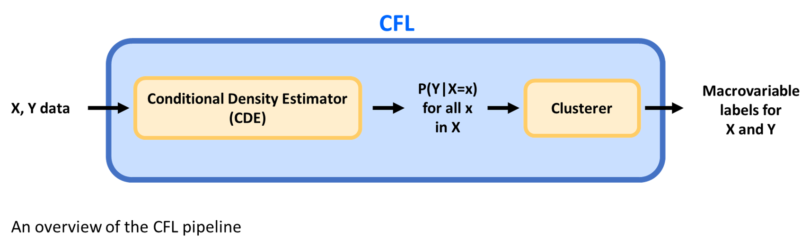

Background 
---------------------

Macrovariables are a useful way to summarize the relevant features detailed, low-level data at a higher level. For example, instead of keeping track of the kinetic energy of every particle in a room, we can instead monitor just the temperature of the room. In this case, 'temperature' is a macrovariable which summarizes the kinetic energy in the room. Additionally, all the particle configurations which have the same temperature (i.e. are part of the same macrovariable class) may differ in some ways, but for many purposes, are functionally the same. Thus, macrovariables can abstract away unnecessary information while preserving important distinctions. Which features are important to distinguish depends on the task for which the macrovariable is being used. 

Causal Feature Learning (CFL) is an algorithm designed to construct macrovariables from low-level data in an unsupervised manner while accounting for the causal relationships between these macrovariables. CFL is designed to take two data sets as input. The `X` dataset contains all of the features which may potentially cause the effects seen in the `Y` dataset. The word "potentially" is used because both datasets may contain features which turn out not to be causally relevant; if that is the case, then CFL should not consider them when assigning a macrovariable label. CFL partitions each input dataset into a set of macrovariables: `X` into a set of macro-causes (e.g. the temperature of the room) and `Y` into a set of macro-effects (e.g. whether someone turns on the air conditioner). 

CFL works by first learning the conditional probability distribution _P(Y|X)_ (or some reasonable proxy for this distibution). This step is called conditional density estimation, or CDE. It then clusters together `X`s for which the equivalence relation :math:`P(Y|X=x_1) = P(Y|X=x_2)`

 is (approximately) true, followed by clustering `Y`s for which the relation :math:`P(Y=y_1|X) = P(Y=y_2|X)` approximately holds. Thus, CFL works in two steps: first, it estimates a conditional probability distribution; and second, it clusters based on that distribution. The image below provides a visual overview of the inputs and outputs of each step of CFL. 

.. As stated above, CFL learns a method to partition the sample space of each dataset. This information is contained in the parameters of the trained model. These parameters generate the labels that are output at the end of training and can be used to classify new data into macrovariables.
