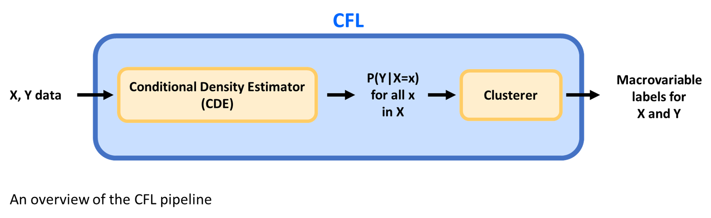

## What is Causal Feature Learning? 

Causal Feature Learning (CFL) is a novel algorithm designed to construct macrovariables that preserve the causal relationships between variables. These macrovariables are intended to reduce the complexity of finding causal relationships in data by identifying a small number of relevant macrostates that can be used to test causal hypotheses. 

### What are macrovariables? 

Macrovariables are a useful way to summarize the relevant features of detailed,
low-level data. For example, instead of attempting to keep track of the kinetic
energy of every particle in a room, we can instead monitor just the temperature
of the room. In this case, 'temperature' is a macrovariable which summarizes
'kinetic energy of each particle in the room', a micro-state. Temperature is a
useful macrovariable because all the particle configurations which have the same
temperature are functionally identical for many purposes. This is an example of
how macrovariables can abstract away unnecessary details while preserving
important distinctions. The relevant features to preserve depend on the task for
which the macrovariable is being used. 

### How does CFL work? 

CFL is designed to take two micro-level data sets as input: a 'causal' data set
(`X`) and an 'effect' data set (`Y`). CFL then assigns each data point in `X`
and `Y` to a macrovariable state: the causal data is partitioned into a set of
macro-causes (e.g. the temperature of the room) and effect data into a set
of macro-effects (e.g. whether or not the air conditioner turns on). 

As discussed above, when constructing a macrovariable, a choice must be made
about what information to preserve and what details to abstract away. In the
case of CFL, we attempt to preserve the causal
relationships between microvariables in the cause and effect data sets. 
In other words, every microvariable configuration assigned to a given
cause macro-state should produce the same effect on `Y` as any other member of
that same macro-state. Similarly, each
microvariable configuration in `Y` that is assigned to the same effect
macro-state should be expected to respond similarly to any cause data.  

CFL works in two steps to create these macrovariables: first, CFL estimates a
conditional probability distribution _P(Y|X)_; second, it clusters the cause
and effect data based on that distribution. The cluster labels that CFL outputs
correspond to the macrovariable state of each data point. 

In addition to these labels, the underlying rules to predict the macrovariable
state of any new data point are implicitly stored in the parameters of the trained CFL
pipeline. New data can be passed through the trained pipeline and given
macrovariable assignments as well. 
