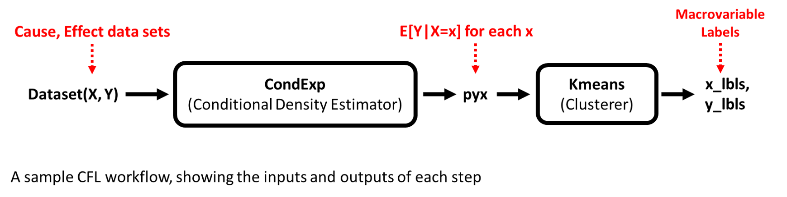

# Some Notes on Conditional Density Estimators (CDEs)

A CDE is a machine learning model that, given variables `x` and `y`, learns to estimate the probability of `y` given `x`. The CDE is the first step of CFL. 

## How the CDE step of CFL works 

In the current implementation of CFL, we calculate the conditional _expection_ during the CDE step. Conditional Expectation takes as input the causal data set `X` and the effect data set `Y` and outputs the expectation (mean) of the probability distribution `P(Y | X= x)` for each sample, `x` in the dataset `X`. These expectations are then clustered in the second step of CFL. 




## Input Shape for CDEs 

- **Most CDEs**

Most of the CDEs provided expect a 2-D input with the shape **(n_samples, n_features)** for both the `X` and the `Y` data. 

- **CNNs**

The `CondExpCNN` and `CondExpCNN` are examples of convolutional neural networks (CNNs). CNNs are well-suited to processing image data. A CNN expects 4-D input images with the shape **(n_samples, n_rows, n_cols, n_channels)** and a 2-D `Y` input. 


```
    # Here is some example code showing how to reshape your data to the correct dimensionality 
    import numpy as np 
    from sklearn.datasets import load_iris

    # get some data 
    two_D = load_iris().data
    two_D.shape
    >>> (150, 4)

    # make this dataset 3D for demo
    X = np.reshape(two_D, (two_D.shape[0], 2, 2))
    X.shape 
    >>> (150, 2, 2)

    # 3-D to 4-D (for a CNN)
    X_new = np.expand_dims(X, -1) 
    X_new.shape
    >>> (150, 2, 2, 1) 

    # flatten a 3-D dataset 
    X_flat = np.reshape(X, (X.shape[0], np.prod(X.shape[1], X.shape[2])))
    X_flat.shape 
    >>> (150, 4)
```


---------------------------------------------------------------------------------------------------------
## Parameter Details 
When constructing a new CDE object, you can customize its parameters. 
This allows you to specify the configuration of your CDE model during instantiation.
Here are some of the parameters you can set:

- `'batch_size'`
    - What is it: batch size for neural network training
    - Valid values: int
    - Default: `32`
    - Applies to: all `CondExpBase` derivatives

- `'n_epochs'`
    - What is it: number of epochs to train for
    - Valid values: int, >0 
    - Default: `20`
    - Applies to: all `CondExpBase` derivatives

- `'optimizer'`
    - What is it: which optimizer to use in training (https://www.tensorflow.org/api_docs/python/tf/keras/optimizers)
    - Valid values: string (i.e. 'adam', 'sgd', etc.)
    - Default: `'adam'`
    - Applies to: all `CondExpBase` derivatives

- `'opt_config'`
    - What is it: a dictionary of optimizer parameters
    - Valid values: python dict. Lookup valid parameters for your optimizer here: https://www.tensorflow.org/api_docs/python/tf/keras/optimizers
    - Default: `{}`
    - Applies to: all `CondExpBase` derivatives

- `'verbose'`
    - What is it: whether to print run updates (currently does this no matter what)
    - Valid values: bool
    - Default: `True`
    - Applies to: all `CondExpBase` derivatives

- `'dense_units'`
    - What is it: list of tf.keras.Dense layer sizes
    - Valid values: int list
    - Default: `[50, data_info['Y_dims'][1]]`
    - Applies to: `CondExpMod`

- `'activations'`
    - What is it: list of activation functions corresponding to layers specified in 'dense_units'
    - Valid values: string list. See valid activations here: https://www.tensorflow.org/api_docs/python/tf/keras/activations
    - Default: `['relu', 'linear']`
    - Applies to: `CondExpMod`

- `'dropouts'`
    - What is it: list of dropout rates after each layer specified in 'dense_units'
    - Valid values: float (from 0 to 1) list.
    - Default: `[0, 0]`
    - Applies to: `CondExpMod`

- `'weights_path'`
    - What is it: path to saved keras model checkpoint to load in to model
    - Valid values: string
    - Default: `None`
    - Applies to: all `CondExpBase` derivatives

- `'loss'`
    - What is it: which loss function to optimize network with respect to (https://www.tensorflow.org/api_docs/python/tf/keras/losses)
    - Valid values: string
    - Default: `mean_squared_error`
    - Applies to: all `CondExpBase` derivatives