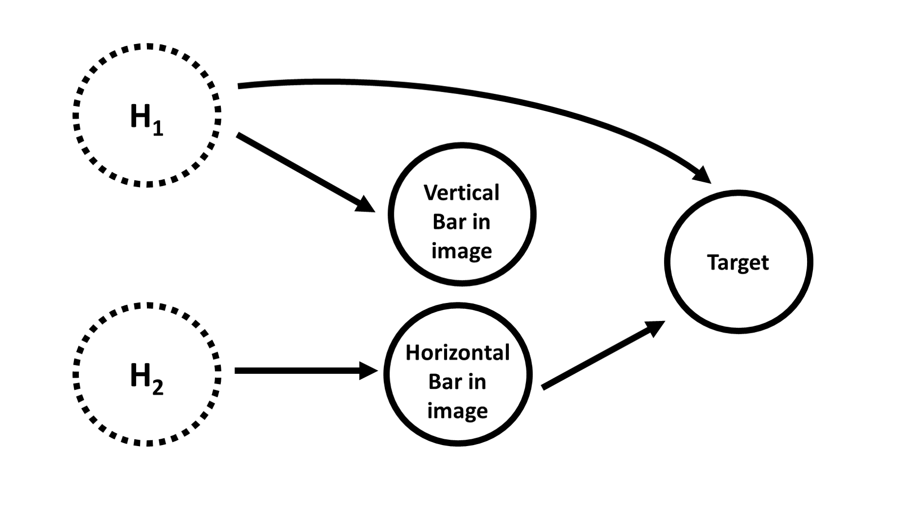
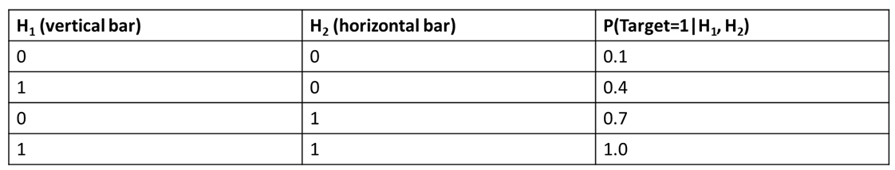

Background: Visual Bars Data
------------------------------------

The Visual Bars dataset is adapted from Chalupka 2015. 

The causal dataset consists of a set of binary (black-and-white) images. These images each have a black background 
and contain white pixels of random noise. Each image may also contain either a white vertical and/or a horizontal bar. Below are a few sample images. 

The effect dataset (aka the "target") is, in this case, a single-dimensional, binary variable. In other words, there is only one variable in the target data set, and that variable can either take on the value of "0" or "1". 

The underlying causal structure used to generate the visual bars images is shown below. The solid circles are the observed variables, the dotted lines are hidden (unobserved) variables, and the arrows denote a causal relationship from one variable to another. 

The causal graph includes two 'hidden variables' (`H1` and `H2`), whether an image contains a horizontal and/or vertical bar, and the target variable's value. The values of hidden variables are not observed directly in the data, but they impact the values of variables that we do observe. 

More specifically, when the `H1` hidden variable is "on", that causes a vertical bar to be present in the image. It also increases the probability that the target variable's value will be `1`. The `H2` hidden variable causes a horizontal bar to be present in the image, but does not directly impact the value of the target. The presence of a horizontal bar in the image increases the probability of the target's value being `1`, but the presence of a vertical bar does not directly impact the value of the target variable. 

Wow! All that's a little confusing. What does it mean? 

Basically, this means that there is confounding in our data! You can see in the image above that `H1` has influence on both the contents of the images, and on the target directly. Confounding makes disentangling the causal relationships a little more complicated. 

So, for this data set, we want CFL to separate the images into four observational macrovariables: one for each combination of values for `H1` and `H2`. This will allow later researchers to design later experiments that determine which of the differences in these macrovariables are causally important (vs merely predictive).

The table below shows the 'ground truth' probability of the target value being `1`, given each possible state of the hidden variables. These values are used to generate the target values. At the end of the CDE step of CFL, we want to recover the probabilities in the rightmost column as accurately as possible, and by the end of the clustering step, recover the existence of these four categories.

#### References 

Chalupka, K., Perona, P., Eberhardt, F. (2015). Visual Causal Feature Learning. Proceedings of the Thirty-First Conference on Uncertainty in Artificial Intelligence. 